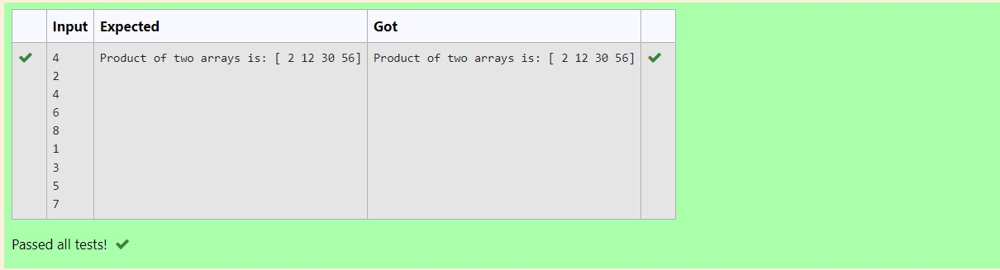

# Multiplying-two-matrix...

## AIM:
To write a program to perform Multiplying-two-matrix using python programming.

## ALGORITHM:
### Step 1:
Import Numpy as np.

### Step 2:
Get input from the user.

### Step 3:
Create empty lists l1 and l2.

### Step 4:
Use for loop to append the values into the list created.

### Step 5:
Print the product of two arrays.

## PROGRAM: 
```

import numpy as np
z,y=[],[]
a=int(input())
for i in range(a):
    z.append(int(input()))
for i in range(a):
    y.append(int(input()))
var1=np.array(z)
var2=np.array(y)
res=var1*var2
print("Product of two arrays is:",res)

```
## OUTPUT:


## RESULT:
Thus the program is written to perform Multiplying-two-matrix using python programming.